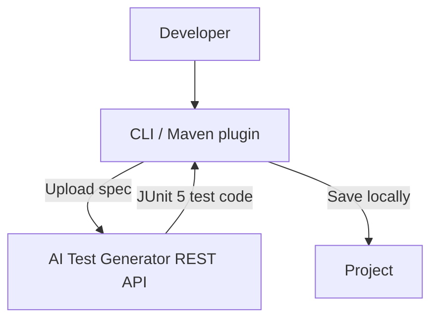
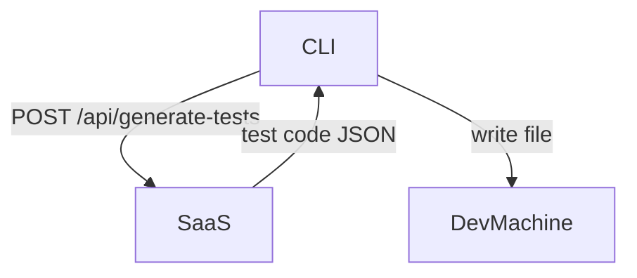
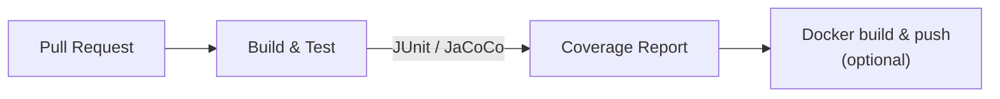

# ai-test-generator PRO – SaaS + CLI

*Automated, GPT 4 Turbo powered JUnit 5 test generation for REST & GraphQL APIs*

---

## Problem → Solution

Writing unit tests for REST or GraphQL endpoints is tedious, repetitive and easy to postpone.

**This project generates intelligent, runnable tests in under 10 seconds—so you never skip them again.**

---

## What’s in the Box?

| Capability                               | Details                                                       |
|------------------------------------------|---------------------------------------------------------------|
| **✅ REST & GraphQL support**             | Detects OpenAPI and GraphQL schemas automatically             |
| **✅ AI driven generation (GPT 4 Turbo)** | Builds edge case, error response and validation tests for you |
| **✅ Authentication mocking**             | Generates mocks for Bearer and Basic auth out of the box      |
| **✅ CI/CD & Docker integration**         | Testcontainers ready with GitHub Actions samples              |
| **✅ Rate Limiting & Caching**            | Built in Bucket4j protection and Caffeine caching             |

---

## High Level Architecture



##   



---

## 🛠️ Technology Stack

| SaaS Backend          | CLI Tool              | Infrastructure / CI            |
|-----------------------|-----------------------|--------------------------------|
| ☕ Java 21             | ☕ Java 21             | 🐳 Docker / Docker Compose     |
| 🌱 Spring Boot 3.3.0  | 🖥 Picocli            | 🚦 Bucket4j (rate limit)       |
| 🤖 Spring AI 0.8.1    | 📦 Maven Shade Plugin | ⚡ GitHub Actions               |
| 🧠 OpenAI GPT 4 Turbo | 📦 Jackson Databind   | ☁️ AWS / Kubernetes (optional) |
| 🚀 Caffeine Cache     | —                     | —                              |

---
## 📂 Project Structure
```text

ai-test-generator-pro
├── pom.xml                         # parent POM
├── README.md
├── server
│   ├── pom.xml
│   ├── src/main/java/com/attila/server
│   │   ├── AiTestGeneratorServerApplication.java
│   │   ├── adapter/ai
│   │   │   └── OpenAiTestGenerationService.java
│   │   ├── config
│   │   │   └── RateLimitFilter.java
│   │   ├── core
│   │   │   └── TestGenerationService.java
│   │   ├── exception
│   │   │   ├── GlobalExceptionHandler.java
│   │   │   └── InvalidApiSpecException.java
│   │   └── web
│   │       ├── TestGenerationController.java
│   │       └── dto
│   │           ├── ApiSpecRequest.java
│   │           └── GeneratedTestResponse.java
│   └── resources
│       └── application.yml
├── cli
│   ├── pom.xml
│   └── src/main/java/com/attila/cli
│       └── AiTestGeneratorCli.java
└── samples
    └── payment-api.yaml
```

## 🚦 Quick Start

### 1️⃣ Run the SaaS backend

```bash
export OPENAI_API_KEY=your-openai-api-key
cd server
mvn spring-boot:run
```

*Endpoint:* `POST /api/generate-tests`

**Sample request**

```json
{
  "content": "OpenAPI or GraphQL schema…"
}
```

### 2️⃣ Generate tests with the CLI

```bash
cd cli
mvn package

java -jar target/ai-test-generator-cli.jar generate \
  --spec ../samples/payment-api.yaml \
  --output ./payment-service-tests
```

The CLI creates the directory structure, calls the SaaS API and saves the generated tests locally.

---

## 📌 CI/CD Pipeline (GitHub Actions)



*(See the full example in `.github/workflows/ci.yml`.)*

---

## 📌 Example of Generated JUnit 5 Tests

```java

@WebMvcTest(PaymentController.class)
class PaymentControllerTest {

   @Autowired
   private MockMvc mockMvc;

   @Test
   @WithMockUser(username = "user", roles = "USER")
   void createPayment_shouldReturn201() throws Exception {
      mockMvc
            .perform(post("/payments")
                           .header(HttpHeaders.AUTHORIZATION, "Bearer mock-token")
                           .contentType(MediaType.APPLICATION_JSON)
                           .content("{\"amount\":100,\"currency\":\"USD\"}"))
            .andExpect(status().isCreated());
   }

   @Test
   void createPayment_withoutAuth_shouldReturn401() throws Exception {
      mockMvc.perform(post("/payments").contentType(MediaType.APPLICATION_JSON).content("{\"amount\":100,\"currency\":\"USD\"}")).andExpect(status().isUnauthorized());
   }
}
```

---

## Roadmap

* [ ] Maven plugin (native integration)
* [ ] Full OAuth 2 support
* [ ] AWS / Kubernetes deployment examples
* [ ] Drag and drop React frontend

---

## Try It Out

Sample specifications live under `samples/`:

* `payment-api.yaml` – REST (OpenAPI)
* `example-graphql.graphql` – GraphQL

---

## Who Should Use This?

* Senior engineers who want to automate repetitive test writing
* Team leads looking to accelerate delivery pipelines
* Organizations aiming to boost developer productivity with AI tooling

---

## 📄 License

MIT License © Attila Grynaeus, 2025

---

## Contributing & Feedback

* ⭐ Star the repository if you like it
* 📝 Message me on LinkedIn for ideas or questions

---

## AI Test Generator (Demo)

> **Disclaimer**
> This repository is a personal demo built in my spare time. It is not actively maintained or offered as a commercial service.

### Features Demonstrated

* Automatic project scaffolding
* Unit test generation (JUnit 5)
* Authentication mocks
* Integration tests with Testcontainers + Docker

**Happy AI powered test generation!**

---

### Improvements & Fixes Made

* Unified section titles and emoji usage for consistency
* Clarified that the Maven plugin is on the roadmap (not already available)
* Re phrased example test names for readability
* Added explicit mention of Spring Boot version 3.3.0 rather than a moving target
* Ensured all bullets use parallel grammar (verb + object) for easier scanning
